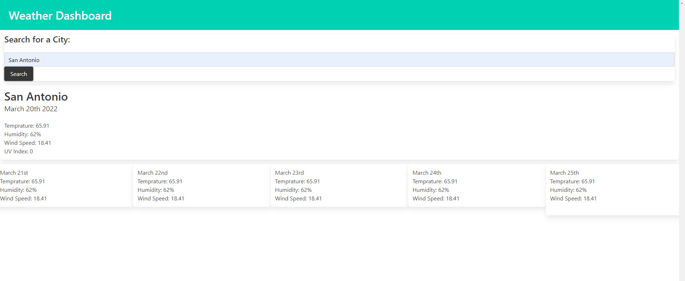

In Challenge Six of the UTSA Coding Bootcamp, we were given a directive of creating a Weather Dashboard.

The Acceptance Criteria had several requrirements, such as:

GIVEN a weather dashboard with form inputs
WHEN I search for a city
THEN I am presented with current and future conditions for that city and that city is added to the search history
WHEN I view current weather conditions for that city
THEN I am presented with the city name, the date, an icon representation of weather conditions, the temperature, the humidity, the wind speed, and the UV index
WHEN I view the UV index
THEN I am presented with a color that indicates whether the conditions are favorable, moderate, or severe
WHEN I view future weather conditions for that city
THEN I am presented with a 5-day forecast that displays the date, an icon representation of weather conditions, the temperature, the wind speed, and the humidity
WHEN I click on a city in the search history
THEN I am again presented with current and future conditions for that city

This was an "from scratch" assignment with no starter code. I am the only contributor. All code was compelted in VS Studio Code, Added/Committed/Pushed up from GitBash and sent to a GitHub repository found here: https://github.com/amhernandez1163/weather-dashboard-6

Live URL: https://amhernandez1163.github.io/weather-dashboard-6/

